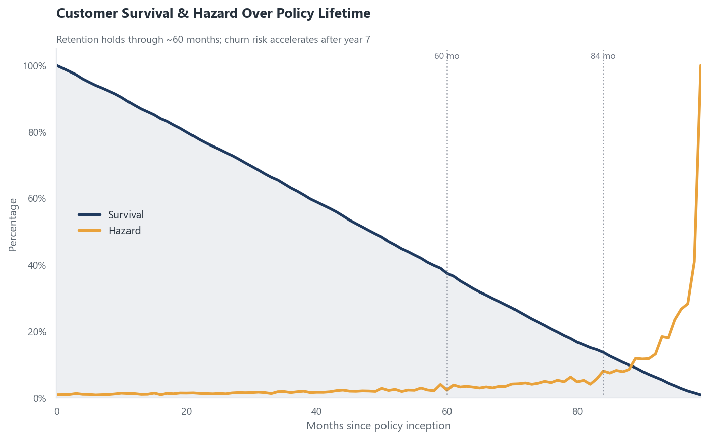
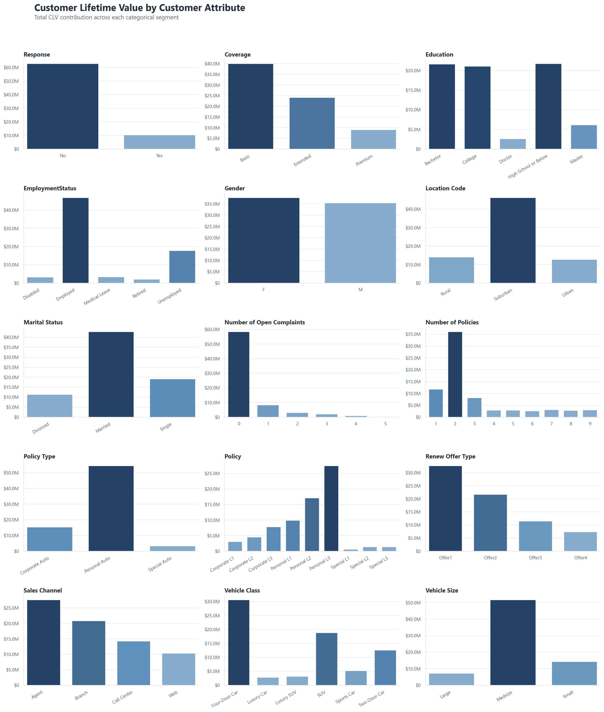
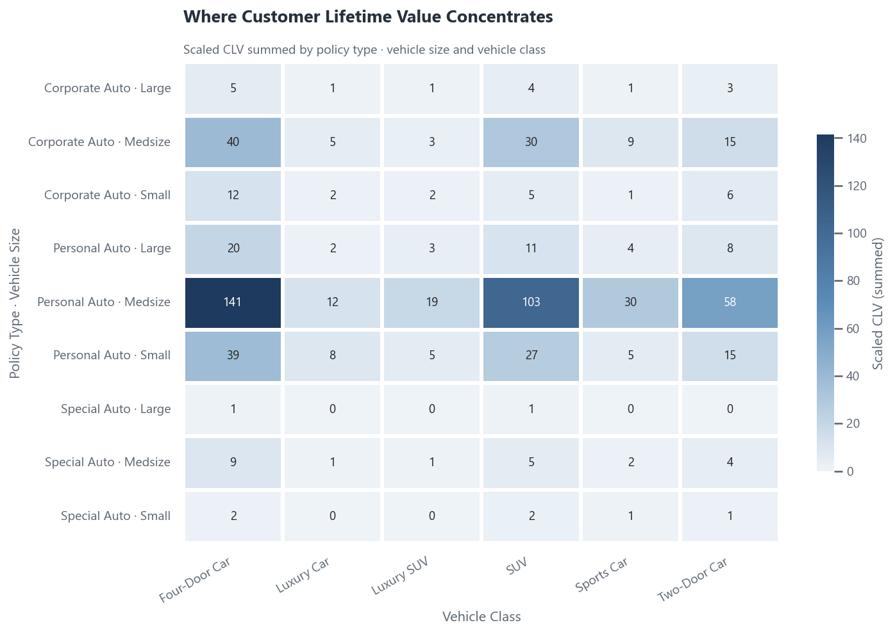
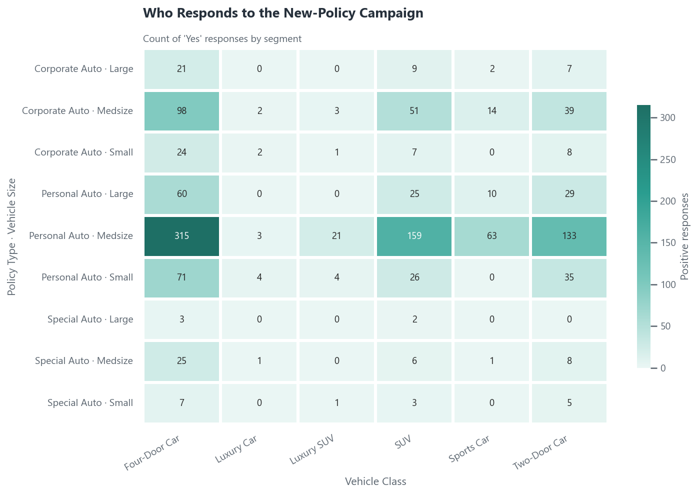

#  Auto Insurance Analytics

> **Customer Lifetime Value · Churn & Survival · Campaign Response · Predictive Modeling**

An end-to-end analytics study of an auto-insurance book of business. The project turns raw
policy data into decisions — identifying high-value customer segments, quantifying churn risk
across the policy lifetime, understanding who responds to new-policy campaigns, and benchmarking
machine-learning models that predict customer lifetime value and campaign response.

<p align="center">
  
</p>

---

## Highlights

| Area | Key takeaway |
|---|---|
| **Value concentration** | `Personal Auto · Medsize` (Four-Door & SUV) drives the majority of total CLV. |
| **Retention** | Survival holds strong for 5–7 years; churn risk spikes near month 84 (~7 years). |
| **Targeting** | Response and value concentrate in the **same** segments — marketing spend can be focused tightly. |
| **CLV prediction** | Random Forest / Gradient Boosting explain **~93%** of CLV variance (R² ≈ 0.93). |
| **Response prediction** | Random Forest gives the best **F1 (~0.99)** for identifying likely responders. |

---

## What's inside

The analysis is organized into a single, fully-executed notebook
([`AutoInsuranceAnalysis.ipynb`](AutoInsuranceAnalysis.ipynb)):

1. **Setup & visual theme** — a reusable clean light-corporate chart style.
2. **Data loading & cleaning** — drop non-predictive identifiers, recast count fields, split feature roles.
3. **Customer Lifetime Value** — segment profiling and a value-concentration heatmap.
4. **Churn analysis** — survival & hazard curves reconstructed from first principles.
5. **Predictive modeling** — CLV regression and campaign-response classification with model benchmarking.

---

## Selected visuals

**Total CLV by customer attribute**

<p align="center"></p>

**Where value concentrates &nbsp;·&nbsp; Who responds to the campaign**

<p align="center">
  
  
</p>

---

## Methods

- **EDA & visualization** — segment-level CLV profiling, pivot heatmaps, correlation analysis.
- **Survival analysis** — retention, hazard, and survival curves derived from policy tenure.
- **Outlier treatment** — IQR-based trimming of the extreme upper tail of CLV.
- **Regression (CLV)** — Linear / Ridge / Lasso, SVR, KNN, Random Forest, Gradient Boosting,
  with a shared preprocessing pipeline and randomized hyperparameter search.
- **Classification (response)** — Logistic Regression, SVM, Random Forest, Gradient Boosting,
  evaluated with accuracy, precision, recall, F1, and a confusion matrix.

## Tech stack

`Python` · `pandas` · `NumPy` · `scikit-learn` · `matplotlib` · `seaborn`

## Getting started

```bash
# 1. Install dependencies
pip install pandas numpy scikit-learn matplotlib seaborn jupyter

# 2. Launch the notebook
jupyter notebook AutoInsuranceAnalysis.ipynb
```

The dataset lives in [`data/`](data/) and is the
[IBM Watson Marketing Customer Value Data](https://www.kaggle.com/datasets/pankajjsh06/ibm-watson-marketing-customer-value-data/).

## Project structure

```
Auto Insurance Analysis/
├── AutoInsuranceAnalysis.ipynb        # Main analysis notebook (fully executed)
├── data/
│   └── WA_Fn-UseC_-Marketing-Customer-Value-Analysis.csv
├── CLV_hist.jpg                       # Total CLV by attribute
├── CLV_contribution.png               # CLV concentration heatmap
├── Response.png                       # Campaign-response heatmap
├── hazard_survival_churn_analysis.png # Survival & hazard curves
└── Readme.md
```

## References

- [Customer Lifetime Value — Kaggle](https://www.kaggle.com/code/sittakonphommee/customer-lifetime-value)
- [Customer Lifetime Value (lab) — Kaggle](https://www.kaggle.com/code/putanyn/660632067-3rd-lab-customer-lifetime-value#Algorithm-Implementation)
